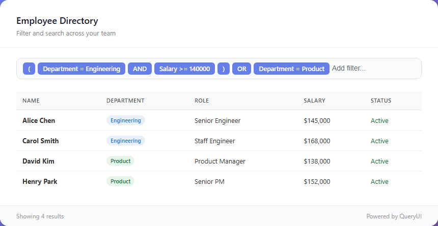

<div align="center">

# QueryChips

### The framework-agnostic filter UI & query builder for TypeScript

Build beautiful, accessible, tag-based filter components in **React**, **Vue**, or **vanilla JavaScript** — and turn every user interaction into ready-to-run **Elasticsearch**, **SQL**, **MongoDB**, and **GraphQL** queries.

[](https://www.npmjs.com/package/querychips)
[](https://www.npmjs.com/package/querychips)
[](https://bundlephobia.com/package/querychips)
[](https://www.npmjs.com/package/querychips?activeTab=dependencies)
[](https://www.typescriptlang.org/)
[](https://opensource.org/licenses/MIT)

<p align="center">
  
</p>

[**Installation**](#-installation) · [**Quick Start**](#-quick-start) · [**Query Generation**](#-query-generation) · [**Theming**](#-theming) · [**API**](#-api) · [**Examples**](./examples)

</div>

---

## Why QueryChips?

Building a filter bar that feels as good as the ones in Linear, GitHub, or Notion usually means weeks of fiddling with dropdowns, keyboard handling, focus traps, accessibility, and query serialization. **QueryChips gives you all of that in a single, zero-dependency package** — and it works with whatever stack you're already on.

- 🧩 **Truly framework-agnostic** — one core, first-class wrappers for **React** and **Vue**, and a clean API for **vanilla JS** or any other framework.
- 🪄 **Smart field inference** — point it at your data and it auto-detects field types (string, number, boolean, enum, date) and the right operators for each.
- 🔍 **Query builder built in** — every filter compiles to **Elasticsearch DSL, parameterized SQL, MongoDB filters, and GraphQL** — no manual serialization.
- ⌨️ **Keyboard-first UX** — full arrow-key / Enter / Escape / Tab / Backspace navigation, just like the apps your users love.
- ♿ **Accessible by default** — ARIA roles, screen-reader support, and managed focus out of the box.
- 🧠 **Advanced boolean logic** — nested groups with `AND` / `OR` and parentheses for complex queries.
- 🎨 **12 themes + full CSS-variable theming** — Material, Bootstrap, Tailwind, Ant Design, MUI, Chakra, and more.
- 🌍 **16 languages** — built-in i18n with custom translation support.
- 📦 **Zero runtime dependencies & fully typed** — tiny footprint, exported types for everything.

> **Keywords:** filter UI · query builder · search component · faceted search · Elasticsearch query builder · SQL query builder · MongoDB filter · GraphQL filter · React filter component · Vue filter component · TypeScript filter library

## ✨ Features

| | |
|---|---|
| **Framework agnostic** | React, Vue, vanilla JS, or any framework |
| **Smart field inference** | Auto-detects field types from your data |
| **Query generation** | Elasticsearch, SQL, MongoDB & GraphQL output |
| **Advanced filtering** | Nested groups with `AND` / `OR` logic |
| **Keyboard navigation** | Arrows, Enter, Escape, Tab, Backspace |
| **Accessibility** | ARIA labels, screen readers, focus management |
| **12 built-in themes** | Plus full custom theming via CSS variables |
| **16 languages** | i18n with custom translation support |
| **100% TypeScript** | Exported types for every interface |
| **Zero dependencies** | No runtime deps, tree-shakeable ESM + UMD |

## 📦 Installation

```bash
npm install querychips
```

Import the styles once in your app:

```js
import 'querychips/styles';
```

Or drop it in via CDN — no build step required:

```html
<link rel="stylesheet" href="https://unpkg.com/querychips@latest/dist/styles.css">
<script src="https://unpkg.com/querychips@latest/dist/querychips.js"></script>
```

## 🚀 Quick Start

### Vanilla JavaScript

```js
import { QueryChips } from 'querychips';

const queryChips = new QueryChips({
  data: [
    { name: 'Alice', department: 'Engineering', salary: 95000 },
    { name: 'Bob', department: 'Design', salary: 78000 },
  ],
  inferFields: true,
  onChange: (filteredData, state) => {
    console.log('Filtered:', filteredData);
  },
});

queryChips.mount(document.getElementById('filter-container'));
```

### React

```tsx
import { QueryChipsReact } from 'querychips/react';

function App() {
  return (
    <QueryChipsReact
      data={data}
      inferFields={true}
      onChange={(filteredData, state) => setResults(filteredData)}
      queryLanguages={['elasticsearch', 'sql']}
    />
  );
}
```

### Vue

```vue
<template>
  <QueryChipsVue :data="data" :inferFields="true" @change="handleChange" />
</template>

<script setup>
import QueryChipsVue from 'querychips/vue';

const handleChange = (filteredData, state) => {
  console.log('Filtered:', filteredData);
};
</script>
```

> 💡 **Want to see it live?** Runnable React, Vue, vanilla, and Elasticsearch demos live in the [`examples/`](./examples) folder.

## ⚙️ Configuration

### Constructor Options

| Option | Type | Default | Description |
|--------|------|---------|-------------|
| `data` | `TData[]` | **required** | Array of objects to filter |
| `fields` | `Field[]` | auto-inferred | Field definitions for filtering |
| `inferFields` | `boolean` | `true` | Auto-detect fields from data |
| `enumThreshold` | `number` | `10` | Max unique values before a string field is treated as free-text instead of enum |
| `autoApply` | `boolean` | `true` | Apply filters on every change |
| `onChange` | `(filteredData, state) => void` | -- | Callback when filtered data changes |
| `onQueryChange` | `(queries, state) => void` | -- | Callback when generated queries change |
| `queryLanguages` | `QueryLanguage[]` | `['elasticsearch']` | Query formats to generate |
| `theme` | `QueryChipsTheme` | `DEFAULT_THEME` | Theme configuration |
| `language` | `string` | `'en'` | i18n language code |
| `translation` | `Translation` | -- | Custom translation object (overrides `language`) |
| `defaultQuery` | `Filter[] \| AdvancedFilterState` | -- | Pre-populated filters |
| `container` | `HTMLElement` | -- | Mount target (alternative to calling `mount()`) |
| `onError` | `(error) => void` | -- | Error callback |

### Field Definition

```ts
interface Field {
  key: string;        // Property name in your data objects
  label: string;      // Display label
  type: FieldType;    // 'string' | 'number' | 'boolean' | 'enum' | 'date'
  values?: string[];  // Allowed values (required for 'enum' type)
  placeholder?: string;
}
```

### Operators by Field Type

| Type | Operators |
|------|-----------|
| `string` | `=` `!=` `contains` `startsWith` `endsWith` `wildcard` `prefix` `regexp` `fuzzy` `like` `not_like` `regex` `not_regex` |
| `number` | `=` `!=` `>` `<` `>=` `<=` `between` `not_between` |
| `boolean` | `=` `!=` |
| `enum` | `=` `!=` |
| `date` | `=` `!=` `>` `<` `>=` `<=` `between` `not_between` |

## 🔎 Filtering

### Simple Filters

The UI guides users through a step-by-step flow: **field** → **operator** → **value**. After completing a filter, a **logical operator** step (AND/OR) connects it to the next filter.

```ts
// Programmatic filter
queryChips.setFilters([
  { id: '1', field: 'department', operator: '=', value: 'Engineering' },
  { id: '2', field: 'salary', operator: '>=', value: 80000 },
]);
```

### Advanced Filters (Groups)

Type `(` to open a group and `)` to close it. Groups allow nested boolean logic:

```
( department = Engineering AND salary >= 80000 ) OR ( department = Design )
```

Pre-populate advanced filters with `defaultQuery`:

```ts
const queryChips = new QueryChips({
  data,
  defaultQuery: {
    conditions: [
      { id: '1', field: 'department', operator: '=', value: 'Engineering' },
      { id: '2', field: 'salary', operator: '>=', value: 80000 },
    ],
    logicalOperators: ['AND'],
  },
});
```

## 🗄️ Query Generation

Turn user-built filters into production-ready queries for your backend. Enable output by setting `queryLanguages` and listening via `onQueryChange`:

```ts
const queryChips = new QueryChips({
  data,
  queryLanguages: ['elasticsearch', 'sql', 'mongodb', 'graphql'],
  onQueryChange: (queries, state) => {
    // queries.elasticsearch -- Elasticsearch DSL (bool, match, term, range...)
    // queries.sql           -- { query: string, parameters: unknown[] }
    // queries.mongodb       -- { filter: object, options: object }
    // queries.graphql       -- { query: string, variables: object }
  },
});
```

SQL output is **parameterized** (safe against injection), and every format mirrors the exact boolean structure the user built — including nested groups.

## 🎨 Theming

### Pre-built Themes

```ts
import { DARK_THEME, MATERIAL_THEME } from 'querychips';

const queryChips = new QueryChips({
  data,
  theme: DARK_THEME,
});
```

Available themes: `DEFAULT_THEME`, `LIGHT_THEME`, `DARK_THEME`, `MATERIAL_THEME`, `MATERIAL_DARK_THEME`, `BOOTSTRAP_THEME`, `TAILWIND_THEME`, `ANT_DESIGN_THEME`, `CHAKRA_THEME`, `MUI_THEME`, `BULMA_THEME`, `FOUNDATION_THEME`

### Custom Themes (CSS Variables)

```ts
const queryChips = new QueryChips({
  data,
  theme: {
    mode: 'custom',
    variables: {
      '--querychips-bg-color': '#1a1a2e',
      '--querychips-text-color': '#e0e0e0',
      '--querychips-border-color': '#333',
      '--querychips-focus-border-color': '#667eea',
      '--querychips-dropdown-bg': '#16213e',
      '--querychips-dropdown-hover-bg': '#0f3460',
      '--querychips-tag-bg': '#667eea',
      '--querychips-tag-text': '#ffffff',
    },
  },
});
```

Theme modes: `'default'` (built-in styles), `'custom'` (CSS variables), `'none'` (no injected styles).

<details>
<summary>All CSS variables</summary>

**Container:** `--querychips-text-color`, `--querychips-bg-color`, `--querychips-border-color`, `--querychips-focus-border-color`, `--querychips-focus-shadow`

**Input:** `--querychips-placeholder-color`

**Tags:** `--querychips-tag-bg`, `--querychips-tag-border`, `--querychips-tag-text`, `--querychips-tag-hover-bg`, `--querychips-tag-hover-border`, `--querychips-tag-remove-color`, `--querychips-tag-remove-hover-bg`, `--querychips-tag-remove-hover-color`

**Dropdown:** `--querychips-dropdown-bg`, `--querychips-dropdown-border`, `--querychips-dropdown-text`, `--querychips-dropdown-hover-bg`, `--querychips-dropdown-selected-bg`, `--querychips-dropdown-selected-text`

**Filter tags:** `--querychips-filter-tag-bg`, `--querychips-filter-tag-border`, `--querychips-filter-tag-text`, `--querychips-filter-tag-hover-bg`, `--querychips-filter-tag-hover-border`, `--querychips-filter-tag-remove-color`, `--querychips-filter-tag-remove-hover-bg`, `--querychips-filter-tag-remove-hover-color`

**Validation:** `--querychips-valid-bg`, `--querychips-valid-color`, `--querychips-invalid-bg`, `--querychips-invalid-color`, `--querychips-incomplete-bg`, `--querychips-incomplete-color`

</details>

## 🌍 Internationalization

### Built-in Languages

```ts
const queryChips = new QueryChips({
  data,
  language: 'fr', // French
});
```

Supported: `en`, `es`, `fr`, `de`, `it`, `pt`, `ja`, `ko`, `zh`, `ru`, `ar`, `hi`, `tr`, `pl`, `sv`, `nl`

### Custom Translations

```ts
const queryChips = new QueryChips({
  data,
  translation: {
    placeholder: {
      addFilter: 'Add filter...',
      selectField: 'Select field',
      selectOperator: 'Select operator',
      selectValue: 'Select value',
      selectLogicalOperator: 'Select logic',
      enterValue: 'Enter value',
    },
    validation: { valid: 'Valid', invalid: 'Invalid', incomplete: 'Incomplete', empty: 'Empty' },
    logicalOperators: { AND: 'AND', OR: 'OR' },
    groupOperators: { openGroup: '(', closeGroup: ')' },
    booleanValues: { true: 'Yes', false: 'No' },
    accessibility: {
      filterInput: 'Filter input',
      validationStatus: 'Validation status',
      dropdownList: 'Options',
      dropdownOption: 'Option',
    },
  },
});
```

## 📚 API

### Methods

| Method | Description |
|--------|-------------|
| `mount(element: HTMLElement)` | Mount the component to a DOM element |
| `destroy()` | Remove the instance and clean up all listeners |
| `getState(): QueryChipsState` | Get a copy of the current state |
| `setFilters(filters: Filter[])` | Set filters programmatically |
| `clearFilters()` | Remove all filters and groups |
| `updateConfig(config: Partial<QueryChipsConfig>)` | Update configuration (data, fields, theme, etc.) |
| `updateTheme(theme: QueryChipsTheme)` | Change the theme |
| `updateTranslation(language: string)` | Switch to a built-in language |
| `updateTranslationCustom(translation: Translation)` | Apply a custom translation |

### Callbacks

```ts
// Fires when filtered data changes
onChange?: (filteredData: TData[], state: QueryChipsState) => void;

// Fires when generated queries change
onQueryChange?: (queries: {
  elasticsearch?: ElasticsearchQuery;
  sql?: SQLQuery;
  mongodb?: MongoDBQuery;
  graphql?: GraphQLQuery;
}, state: QueryChipsState) => void;
```

## 🟦 TypeScript

All types are exported from the main package:

```ts
import type {
  QueryChipsConfig,
  QueryChipsState,
  Field,
  FieldType,
  Filter,
  ConditionGroup,
  AdvancedFilterState,
  LogicalOperator,
  QueryLanguage,
  ElasticsearchQuery,
  SQLQuery,
  MongoDBQuery,
  GraphQLQuery,
  QueryChipsTheme,
  Translation,
} from 'querychips';
```

## 🤝 Contributing

Contributions, issues, and feature requests are welcome! Check out the [contributing guide](./CONTRIBUTING.md) and the [open issues](https://github.com/nvana/querychips/issues).

If QueryChips saves you time, please consider giving it a ⭐ on [GitHub](https://github.com/nvana/querychips) — it really helps others discover the project.

## 📄 License

[MIT](./LICENSE) © [nvana](https://github.com/nvana)
